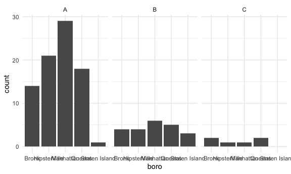

Data wrangling 2, live session
================

## Restaurant inspection

``` r
api_url = "https://data.cityofnewyork.us/resource/43nn-pn8j.csv"

rest_inspections = 
  GET(api_url,  query = list("$limit" = 5000)) %>% 
  content("parsed")
```

    ## Parsed with column specification:
    ## cols(
    ##   .default = col_character(),
    ##   camis = col_double(),
    ##   zipcode = col_double(),
    ##   phone = col_double(),
    ##   inspection_date = col_datetime(format = ""),
    ##   score = col_double(),
    ##   grade_date = col_datetime(format = ""),
    ##   record_date = col_datetime(format = ""),
    ##   latitude = col_double(),
    ##   longitude = col_double(),
    ##   community_board = col_double(),
    ##   bin = col_double(),
    ##   bbl = col_double()
    ## )

    ## See spec(...) for full column specifications.

    ## Warning: 6 parsing failures.
    ##  row   col               expected     actual         file
    ## 1657 phone no trailing characters  456 5808  <raw vector>
    ## 1920 phone a double               __________ <raw vector>
    ## 2065 phone no trailing characters  968 5875  <raw vector>
    ## 2120 phone no trailing characters _          <raw vector>
    ## 3453 phone no trailing characters _420_75    <raw vector>
    ## .... ..... ...................... .......... ............
    ## See problems(...) for more details.

``` r
rest_inspections %>% 
  count(boro, grade) %>% 
  pivot_wider(names_from = grade, values_from = n)
```

    ## # A tibble: 6 x 8
    ##   boro              A  `NA`     B     C     N     P     Z
    ##   <chr>         <int> <int> <int> <int> <int> <int> <int>
    ## 1 0                 1     3    NA    NA    NA    NA    NA
    ## 2 Bronx           174   220    35    14     3     3     1
    ## 3 Brooklyn        487   631    78    38     2    11     3
    ## 4 Manhattan       799   991   108    54    10    10     9
    ## 5 Queens          461   549    81    31     9    14     5
    ## 6 Staten Island    67    80    13     3    NA    NA     2

``` r
rest_inspections = 
  rest_inspections %>% 
  filter(grade %in% c("A", "B", "C"), boro != "0")
```

Let’s look at the pizza places

``` r
rest_inspections %>% 
  mutate(dba = str_to_upper(dba)) %>% 
  filter(str_detect(dba, "PIZZA")) 
```

    ## # A tibble: 111 x 26
    ##     camis dba   boro  building street zipcode  phone cuisine_descrip…
    ##     <dbl> <chr> <chr> <chr>    <chr>    <dbl>  <dbl> <chr>           
    ##  1 4.12e7 LUIG… Broo… 4704     5 AVE…   11220 7.18e9 Pizza           
    ##  2 4.12e7 D'AN… Bronx 1160     PUGSL…   10472 7.19e9 Mexican         
    ##  3 4.14e7 FRAN… Bronx 772      CASTL…   10473 7.19e9 Pizza           
    ##  4 5.00e7 PIZZ… Broo… 1501     PITKI…   11212 7.19e9 Pizza           
    ##  5 5.01e7 LA M… Manh… 1580     1 AVE…   10028 2.12e9 Pizza/Italian   
    ##  6 4.04e7 AMNO… Broo… 4814     13 AV…   11219 7.19e9 Jewish/Kosher   
    ##  7 4.06e7 JOHN… Manh… 260      WEST …   10036 2.12e9 Pizza           
    ##  8 5.01e7 PIZZ… Manh… 2166     FREDE…      NA 2.12e9 Pizza           
    ##  9 4.10e7 THE … Bronx 4024     WHITE…   10466 7.19e9 Pizza           
    ## 10 4.04e7 FRAN… Broo… 2134     FLATB…   11234 7.18e9 Pizza           
    ## # … with 101 more rows, and 18 more variables: inspection_date <dttm>,
    ## #   action <chr>, violation_code <chr>, violation_description <chr>,
    ## #   critical_flag <chr>, score <dbl>, grade <chr>, grade_date <dttm>,
    ## #   record_date <dttm>, inspection_type <chr>, latitude <dbl>, longitude <dbl>,
    ## #   community_board <dbl>, council_district <chr>, census_tract <chr>,
    ## #   bin <dbl>, bbl <dbl>, nta <chr>

``` r
rest_inspections %>% 
  mutate(dba = str_to_upper(dba)) %>% 
  filter(str_detect(dba, "PIZZA")) %>% 
  count(boro, grade) %>% 
  pivot_wider(names_from = grade, values_from = n)
```

    ## # A tibble: 5 x 4
    ##   boro              A     B     C
    ##   <chr>         <int> <int> <int>
    ## 1 Bronx            14     4     2
    ## 2 Brooklyn         21     4     1
    ## 3 Manhattan        29     6     1
    ## 4 Queens           18     5     2
    ## 5 Staten Island     1     3    NA

``` r
rest_inspections %>% 
  mutate(dba = str_to_upper(dba)) %>% 
  filter(str_detect(dba, "PIZZA")) %>% 
  mutate(boro = fct_relevel(boro, "Manhattan")) %>% 
  ggplot(aes(x = boro)) + 
  geom_bar() +
  facet_wrap(. ~ grade)
```


``` r
rest_inspections %>% 
  mutate(dba = str_to_upper(dba)) %>% 
  filter(str_detect(dba, "PIZZA")) %>% 
  mutate(boro = fct_infreq(boro)) %>% 
  ggplot(aes(x = boro)) + 
  geom_bar() +
  facet_wrap(. ~ grade)
```


``` r
rest_inspections %>% 
  mutate(dba = str_to_upper(dba)) %>% 
  filter(str_detect(dba, "PIZZA")) %>% 
  mutate(
    boro = fct_infreq(boro),
    boro = str_replace(boro, "Brooklyn", "HipsterVille")) %>% # 用hipersterville替换Brooklyn的名字, 但这个方法破坏了factor的属性
  ggplot(aes(x = boro)) + 
  geom_bar() +
  facet_wrap(. ~ grade)
```



``` r
rest_inspections %>% 
  mutate(dba = str_to_upper(dba)) %>% 
  filter(str_detect(dba, "PIZZA")) %>% 
  mutate(
    boro = fct_infreq(boro),
    boro = fct_recode
    (boro, "HipsterHQ" = "Brooklyn")) %>% # 用hipersterville替换Brooklyn的名字,这个办法保留了factor的属性
  ggplot(aes(x = boro)) + 
  geom_bar() +
  facet_wrap(. ~ grade)
```


## Napoleon dynamite

GET SOME Napoleon dynamite reviews

``` r
nap_dyn_url = "https://www.amazon.com/Napoleon-Dynamite-Jon-Heder/product-reviews/B00005JNBQ"

napoleon_html = read_html(nap_dyn_url)

review_titles = 
  napoleon_html %>% 
  html_nodes(css = ".a-text-bold span") %>% 
  html_text()

review_text= 
  napoleon_html %>% 
  html_nodes(css = ".review-text-content span") %>% 
  html_text()

tibble(
  tittles = review_titles,
  text = review_text
)
```

    ## # A tibble: 0 x 2
    ## # … with 2 variables: tittles <chr>, text <chr>
