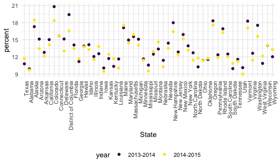

Strings and factors
================

## Strings and regex

``` r
string_vec = c("my", "name", "is", "jeff")

str_detect(string_vec, "e")   ## to identify an element of the strings to corresponding with the parter"e"
```

    ## [1] FALSE  TRUE FALSE  TRUE

``` r
str_replace(string_vec, "jeff", "Jeff") #replace string jeff with Jeff 
```

    ## [1] "my"   "name" "is"   "Jeff"

``` r
string_vec = c(
  "i think we all rule for participating",
  "i think i have been caught",
  "i think this will be quite fun actually",
  "it will be fun, i think"
  )

str_detect(string_vec, "^i think") #`^i think` 在这里代表想要detect “i think” string at start with, but not end wit
```

    ## [1]  TRUE  TRUE  TRUE FALSE

``` r
str_detect(string_vec, "i think$") #要结尾是i think的
```

    ## [1] FALSE FALSE FALSE  TRUE

``` r
string_vec = c(
  "Y'all remember Pres. HW Bush?",
  "I saw a green bush",
  "BBQ and Bushwalking at Molonglo Gorge",
  "BUSH -- LIVE IN CONCERT!!"
  )

str_detect(string_vec,"[Bb]ush")  # "[Bb]ush 代表想要Captical B or lower case B 都被detected
```

    ## [1]  TRUE  TRUE  TRUE FALSE

``` r
string_vec = c(
  '7th inning stretch',
  '1st half soon to begin. Texas won the toss.',
  'she is 5 feet 4 inches tall',
  '3AM - cant sleep :('
  )

str_detect(string_vec, "^[0-9][a-zA-Z]") # 想要detect以一个数字紧接着一个字母（大小写都可以）开头的
```

    ## [1]  TRUE  TRUE FALSE  TRUE

``` r
string_vec = c(
  'Its 7:11 in the evening',
  'want to go to 7-11?',
  'my flight is AA711',
  'NetBios: scanning ip 203.167.114.66'
  )

str_detect(string_vec, "7.11") #`7.11`代表想要detect 7:11，7-11，7.11但是不要711， `.`在这里代表literally anything
```

    ## [1]  TRUE  TRUE FALSE  TRUE

``` r
str_detect(string_vec, "7\\.11") #代表不想要`.`作为special character（=anything），而仅仅作为`.`存在，
```

    ## [1] FALSE FALSE FALSE  TRUE

``` r
#想要一个character不作为specical character就在其前面加一个\，但是因为\本身也是special character， 所以需要再加一个\
```

``` r
string_vec = c(
  'The CI is [2, 5]',
  ':-]',
  ':-[',
  'I found the answer on pages [6-7]'
  )

str_detect(string_vec, "\\[") #代表不想要`[`作为special character（=anything），而仅仅作为`[`存在，
```

    ## [1]  TRUE FALSE  TRUE  TRUE

## Factors

``` r
vec_sex = factor(c("male", "male", "female", "female"))

vec_sex
```

    ## [1] male   male   female female
    ## Levels: female male

``` r
as.numeric(vec_sex)
```

    ## [1] 2 2 1 1

what happens if i relevel

``` r
vec_sex = fct_relevel(vec_sex, "male")  # make male as the first level
vec_sex
```

    ## [1] male   male   female female
    ## Levels: male female

``` r
as.numeric(vec_sex)
```

    ## [1] 1 1 2 2

# NASDUH

``` r
nsduh_url = "http://samhda.s3-us-gov-west-1.amazonaws.com/s3fs-public/field-uploads/2k15StateFiles/NSDUHsaeShortTermCHG2015.htm"

table_marj = 
  read_html(nsduh_url) %>% 
  html_nodes(css = "table") %>% 
  first() %>%
  html_table() %>%
  slice(-1) %>%
  as_tibble()
```

``` r
data_marj = 
  table_marj %>%
  select(-contains("P Value")) %>%  # remove any column names contain " P value"
  pivot_longer(
    -State,
    names_to = "age_year", 
    values_to = "percent") %>%
  separate(age_year, into = c("age", "year"), sep = "\\(") %>%
  mutate(
    year = str_replace(year, "\\)", ""),  # 去掉某一列中每个cell含有的某个特定character
    percent = str_replace(percent, "[a-c]$", ""),
    percent = as.numeric(percent)) %>%
  filter(!(State %in% c("Total U.S.", "Northeast", "Midwest", "South", "West")))
# 上面的filter是代表I don't want to the State variable to be one of either "Total U.S.", "Northeast", "Midwest" or "South", "West"
#%in% operator in R, is used to identify if an element belongs to a vector or Dataframe
```

## NSDUH – FACTORS

``` r
#大概是只改一两个的顺序的时候用relevel，想要按照某种顺序排列全部的时候，用reorder

data_marj %>%
  filter(age == "12-17") %>% 
  mutate(State = fct_relevel(State, "Texas")) %>% # 不想在之后作图的时候state作为a-xis以alphabetical order排序，我想state以Texas 作为default state（作图的时候排在前面），注意这里是relevel
  ggplot(aes(x = State, y = percent, color = year)) + 
    geom_point() + 
    theme(axis.text.x = element_text(angle = 90, hjust = 1))
```



``` r
data_marj %>%
  filter(age == "12-17") %>% 
  mutate(State = fct_reorder(State, percent)) %>% # 不想在之后作图的时候state作为a-xis以alphabetical order排序，我想state以percent从小到大排列作图，注意这里是reorder
  ggplot(aes(x = State, y = percent, color = year)) + 
    geom_point() + 
    theme(axis.text.x = element_text(angle = 90, hjust = 1))
```


